# [📈 Live Status](https://status.transport.miaguila.com): <!--live status--> **🟩 All systems operational**

This repository contains the open-source uptime monitor and status page for [Mi Aguila](miaguila.com), powered by [Upptime](https://github.com/upptime/upptime).

With [Upptime](https://upptime.js.org), you can get your own unlimited and free uptime monitor and status page, powered entirely by a GitHub repository. We use [Issues](https://github.com/MyEagle-Transport/status/issues) as incident reports, [Actions](https://github.com/MyEagle-Transport/status/actions) as uptime monitors, and [Pages](https://status.transport.miaguila.com) for the status page.

<!--start: status pages-->
<!-- This summary is generated by Upptime (https://github.com/upptime/upptime) -->
<!-- Do not edit this manually, your changes will be overwritten -->
<!-- prettier-ignore -->
| URL | Status | History | Response Time | Uptime |
| --- | ------ | ------- | ------------- | ------ |
|  [Admin Web](https://admin.miaguila.com/) | 🟩 Up | [admin-web.yml](https://github.com/Mi-Aguila/status/commits/HEAD/history/admin-web.yml) | 

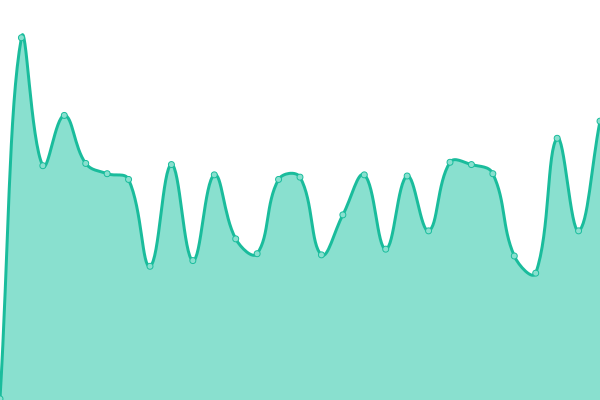 199ms
     
 | 

<a href="https://status.prd.miaguila.com/history/admin-web">100.00%</a>
    

|  [Client Web](https://client.miaguila.com/) | 🟩 Up | [client-web.yml](https://github.com/Mi-Aguila/status/commits/HEAD/history/client-web.yml) | 

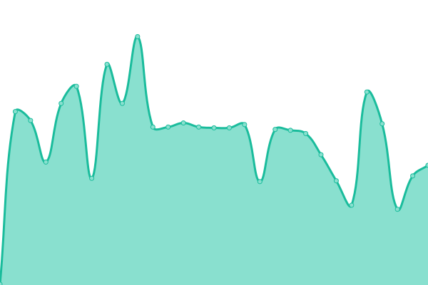 190ms
     
 | 

<a href="https://status.prd.miaguila.com/history/client-web">100.00%</a>
    

|  [KPI Web](https://kpi.prd.miaguila.com/) | 🟩 Up | [kpi-web.yml](https://github.com/Mi-Aguila/status/commits/HEAD/history/kpi-web.yml) | 

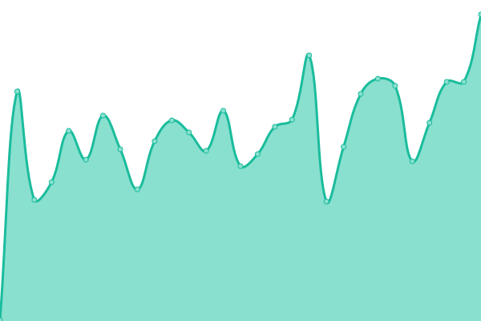 252ms
     
 | 

<a href="https://status.prd.miaguila.com/history/kpi-web">100.00%</a>
    

|  [Metabase Web](https://metabase.prd.miaguila.com/) | 🟩 Up | [metabase-web.yml](https://github.com/Mi-Aguila/status/commits/HEAD/history/metabase-web.yml) | 

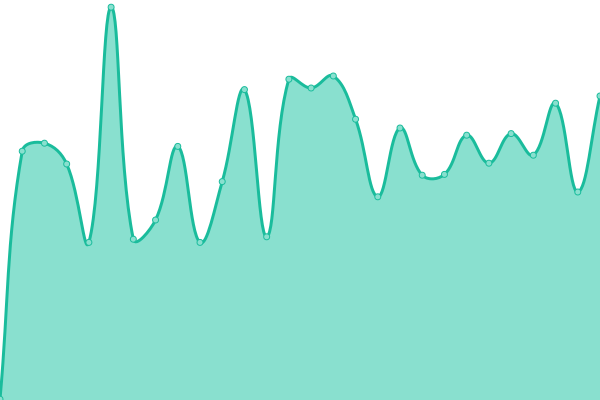 336ms
     
 | 

<a href="https://status.prd.miaguila.com/history/metabase-web">100.00%</a>
    

|  [Control Payments Web](https://control.miaguila.com/) | 🟩 Up | [control-payments-web.yml](https://github.com/Mi-Aguila/status/commits/HEAD/history/control-payments-web.yml) | 

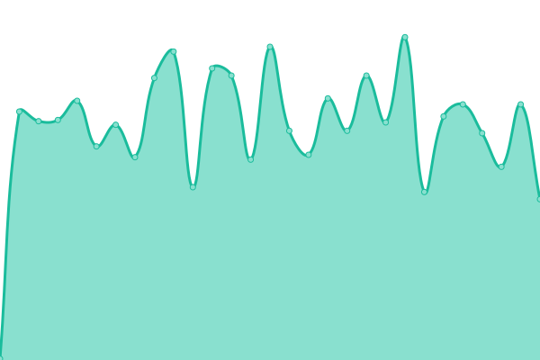 189ms
     
 | 

<a href="https://status.prd.miaguila.com/history/control-payments-web">100.00%</a>
    

|  [Admin Api](https://admin.api.transport.miaguila.com/) | 🟩 Up | [admin-api.yml](https://github.com/Mi-Aguila/status/commits/HEAD/history/admin-api.yml) | 

 380ms
     
 | 

<a href="https://status.prd.miaguila.com/history/admin-api">100.00%</a>
    

|  [Client Api](https://client.api.prd.miaguila.com/) | 🟩 Up | [client-api.yml](https://github.com/Mi-Aguila/status/commits/HEAD/history/client-api.yml) | 

 244ms
     
 | 

<a href="https://status.prd.miaguila.com/history/client-api">100.00%</a>
    

|  [Driver Api](https://driver.api.prd.miaguila.com/) | 🟩 Up | [driver-api.yml](https://github.com/Mi-Aguila/status/commits/HEAD/history/driver-api.yml) | 

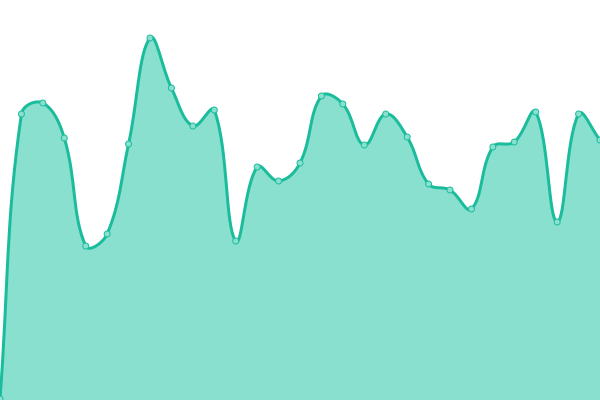 240ms
     
 | 

<a href="https://status.prd.miaguila.com/history/driver-api">100.00%</a>
    

|  [FUEC's Api](https://fuecs.api.transport.miaguila.com/api/v1/pdf) | 🟩 Up | [fuec-s-api.yml](https://github.com/Mi-Aguila/status/commits/HEAD/history/fuec-s-api.yml) | 

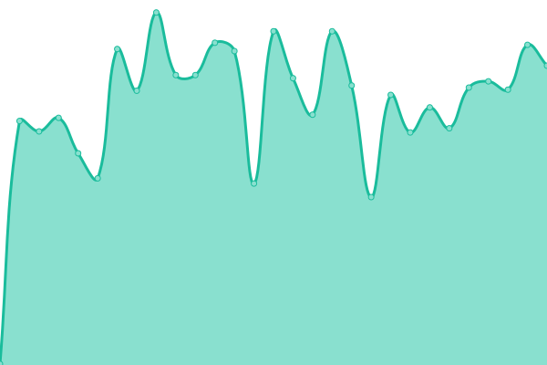 237ms
     
 | 

<a href="https://status.prd.miaguila.com/history/fuec-s-api">100.00%</a>
    

|  [Routing Batching API](https://routing-batching.api.transport.miaguila.com/status) | 🟩 Up | [routing-batching-api.yml](https://github.com/Mi-Aguila/status/commits/HEAD/history/routing-batching-api.yml) | 

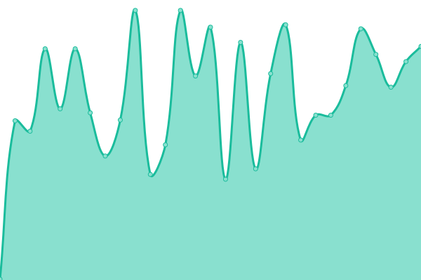 237ms
     
 | 

<a href="https://status.prd.miaguila.com/history/routing-batching-api">100.00%</a>
    

|  [Trips Dispatcher API](https://trips-dispatcher.api.prd.miaguila.com/api/v1/health) | 🟩 Up | [trips-dispatcher-api.yml](https://github.com/Mi-Aguila/status/commits/HEAD/history/trips-dispatcher-api.yml) | 

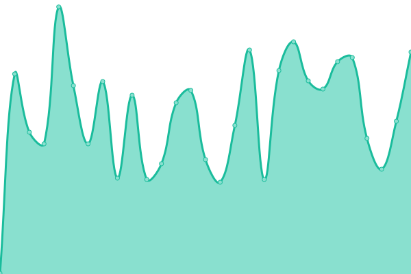 252ms
     
 | 

<a href="https://status.prd.miaguila.com/history/trips-dispatcher-api">100.00%</a>
    

|  [Control Payments Api](https://control.api.prd.miaguila.com/api/v1/health) | 🟩 Up | [control-payments-api.yml](https://github.com/Mi-Aguila/status/commits/HEAD/history/control-payments-api.yml) | 

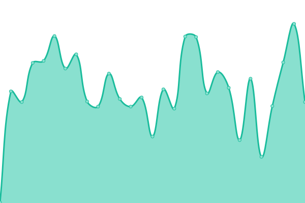 235ms
     
 | 

<a href="https://status.prd.miaguila.com/history/control-payments-api">100.00%</a>
    

|  [Fares Api](https://fareschange.api.transport.miaguila.com/status) | 🟩 Up | [fares-api.yml](https://github.com/Mi-Aguila/status/commits/HEAD/history/fares-api.yml) | 

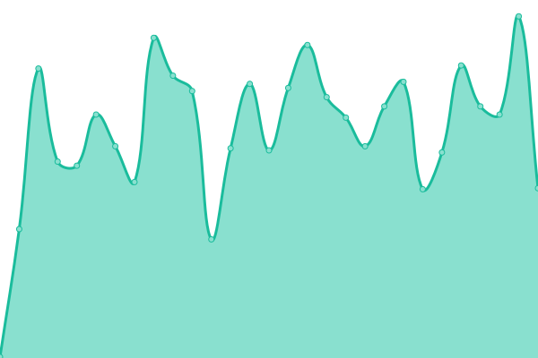 230ms
     
 | 

<a href="https://status.prd.miaguila.com/history/fares-api">100.00%</a>
    

|  [Tasks Server Api (Celery)](https://tasks-server.api.transport.miaguila.com/v1/health/) | 🟩 Up | [tasks-server-api-celery.yml](https://github.com/Mi-Aguila/status/commits/HEAD/history/tasks-server-api-celery.yml) | 

 234ms
     
 | 

<a href="https://status.prd.miaguila.com/history/tasks-server-api-celery">100.00%</a>
    

<!--end: status pages-->

[**Visit our status website →**](https://status.transport.miaguila.com)

## 📄 License

- Powered by: [Upptime](https://github.com/upptime/upptime)
- Code: [MIT](./LICENSE) © [Mi Aguila](miaguila.com)
- Data in the `./history` directory: [Open Database License](https://opendatacommons.org/licenses/odbl/1-0/)
